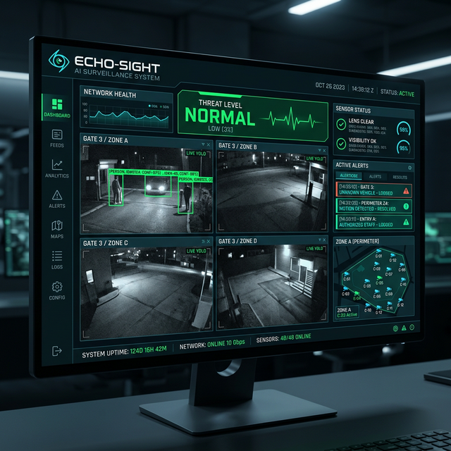

# 👁️ Echo-Sight: Multi-Modal AI Security & Threat Detection 🛡️🔊

Echo-Sight is a high-performance security command center that fuses **Real-Time Computer Vision (YOLOv8)** with **Acoustic Anomaly Detection (YAMNet)**. Designed for low-latency inference, it provides a comprehensive tactical overview of any monitored space.



---

## 🚀 Core Security Features

- **Intelligent Vision (YOLOv8)**: Real-time person tracking and unique identity management.
- **Behavioral Analytics**: Automated Loitering Detection (triggers alerts if a person remains in a restricted zone for >15 seconds).
- **Tamper Protection**: Instant detection of camera interference, including lens blurring or total blackout.
- **Acoustic Intelligence (YAMNet)**: Environmental audio classification to identify glass breaking, shouting, or hardware malfunctions that cameras might miss.
- **📢 AI Voice Alerts**: Integrated Speech Synthesis (Web Speech API) provides real-time verbal warnings during critical breaches (e.g., *"Warning! Loitering detected at Perimeter A"*).

---

## 🧠 The Multi-Modal Engine

Echo-Sight doesn't rely on a single sensor. It uses a **Late-Fusion Logic** to reduce false positives:

1. **Vision Score (60%)**: Analyzes spatial anomalies (tampering, loitering).
2. **Audio Score (40%)**: Analyzes acoustic anomalies (shouting, impact noises).
3. **Threat Fusion**: The system correlates these scores. For example, a "blackout" camera event combined with a "shouting" audio event automatically escalates the threat level to **CRITICAL**, triggers the automated alarm, and logs evidence (snapshot + report).

---

## 🧪 Interactive Scenario Engine

Echo-Sight allows for real-time tactical testing through its scenario engine:
- **Hot-Swapping**: Toggle between "Normal Patrol" and "Threat Simulation" instantly.
- **Scenario Upload**: Upload custom MP4 footage. The system automatically:
  1. Extracts the acoustic profile using **MoviePy**.
  2. Re-initializes both engines with the new data source.
  3. Begins real-time processing and threat assessment.

---

## 🛠️ Technical Stack

- **Backend**: FastAPI (High-performance Python framework)
- **Vision**: Ultralytics YOLOv8 (Object detection & tracking)
- **Audio**: TensorFlow Hub & YAMNet (Global scale audio event classification)
- **Processing**: MoviePy, OpenCV, & Librosa (Video and audio stream manipulation)
- **Frontend**: Jinja2 & HTML5/CSS3 (Tactical Dashboard UI)

---

## 🏗️ Project Structure

```text
Echo-Sight/
├── app.py                 # FastAPI Main Entrypoint
├── core/                  # Security Engines
│   ├── vision_engine.py   # YOLOv8 Tracking & Tamper Logic
│   ├── audio_engine.py    # YAMNet Audio Classification
│   ├── threat_engine.py   # Multi-modal fusion & scoring logic
│   └── reporting.py       # Automated evidence generator
├── static/                # Tactical UI Assets (CSS/JS/Images)
├── templates/             # Dashboard HTML Templates
├── models/                # AI Model weights and local cache
├── evidence_logs/         # Automated threat snapshots and reports
└── requirements.txt       # Project Dependencies
```

---

## 🚀 Setup & Usage

### 1. Clone & Environment
```bash
git clone https://github.com/your-username/echo-sight.git
cd echo-sight
python -m venv venv
# Windows:
.\venv\Scripts\activate
# Linux/macOS:
source venv/bin/activate
pip install -r requirements.txt
```

### 2. Run Server
```bash
python app.py
```
The dashboard will be available at: `http://localhost:5000`

### 3. Usage
Navigate to the dashboard and ensure you click **"INITIALIZE AUDIO SYSTEMS"** to enable the AI Voice Alert system.

---

## 🛡️ License
Distributed under the MIT License.

---
**"Seeing and Hearing for Total Security"**
